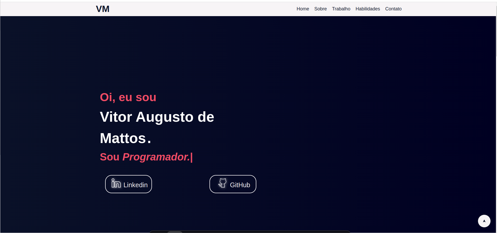
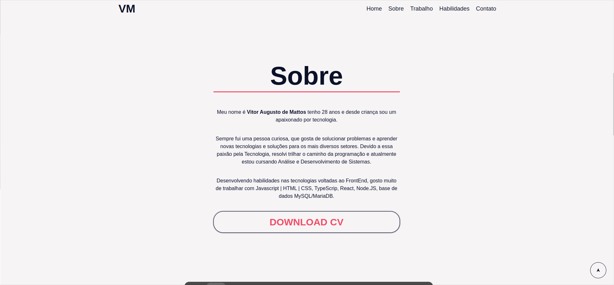

<h1 align="center"><a href="https://landingpagehtml-beta.vercel.app/"> 💻 Projeto Landing Page</a></h1>

Minha primeira Landing Page, feito com HTML e CSS e JavaScript.

  <a href="#-tecnologias">Tecnologias</a>&nbsp;&nbsp;&nbsp;|&nbsp;&nbsp;&nbsp;
  <a href="#-projeto">Projeto</a>&nbsp;&nbsp;&nbsp;|&nbsp;&nbsp;&nbsp;
  <a href="#memo-licença">Licença</a>

  

 

  

  

## 🚀 Tecnologias

Esse projeto foi desenvolvido com as seguintes tecnologias:

- HTML e CSS
- JavaScript 

## :memo: Licença

Esse projeto está sob a licença MIT.

---

Feito por Vitor Augusto [Meu Linkedlin](https://www.linkedin.com/in/viitoraugusto/)
