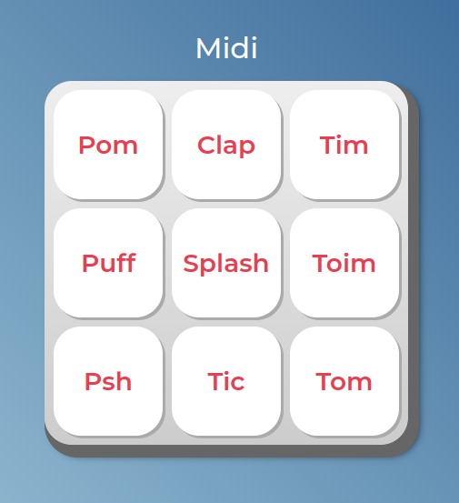

<h1 align="center"><a href="#"> 💻 Projeto Alura Midi</a></h1>

Alura Midi é um projeto de som, com HTML/CSS e JavaScript.

  <a href="#-tecnologias">Tecnologias</a>&nbsp;&nbsp;&nbsp;|&nbsp;&nbsp;&nbsp;
  <a href="#-projeto">Projeto</a>&nbsp;&nbsp;&nbsp;|&nbsp;&nbsp;&nbsp;
  <a href="#memo-licença">Licença</a>

  

 

  

## 🚀 Tecnologias

Esse projeto foi desenvolvido com as seguintes tecnologias:

- HTML e CSS
- JavaScript 

## 💻 Projeto

Como manipular a tag audio do HTML através do JavaScript, como selecionar um elemento a partir de um seletor de id e a reproduzir um som a partir da função play(), A estrutura de uma lista em JavaScript acessar os elementos a partir dos índices,repetição for e como ela pode nos ajudar com um código mais limpo, eventos do teclado e como onkeydowne onkeyup. Como adicionar e remover classes em um elemento HTML através do JavaScript, com as funções add e remove do classList e Condições no código e operadores lógicos.

## Licença

Esse projeto está sob a licença MIT.

---

Feito por Vitor Augusto [Meu Linkedlin](https://www.linkedin.com/in/viitoraugusto/)
