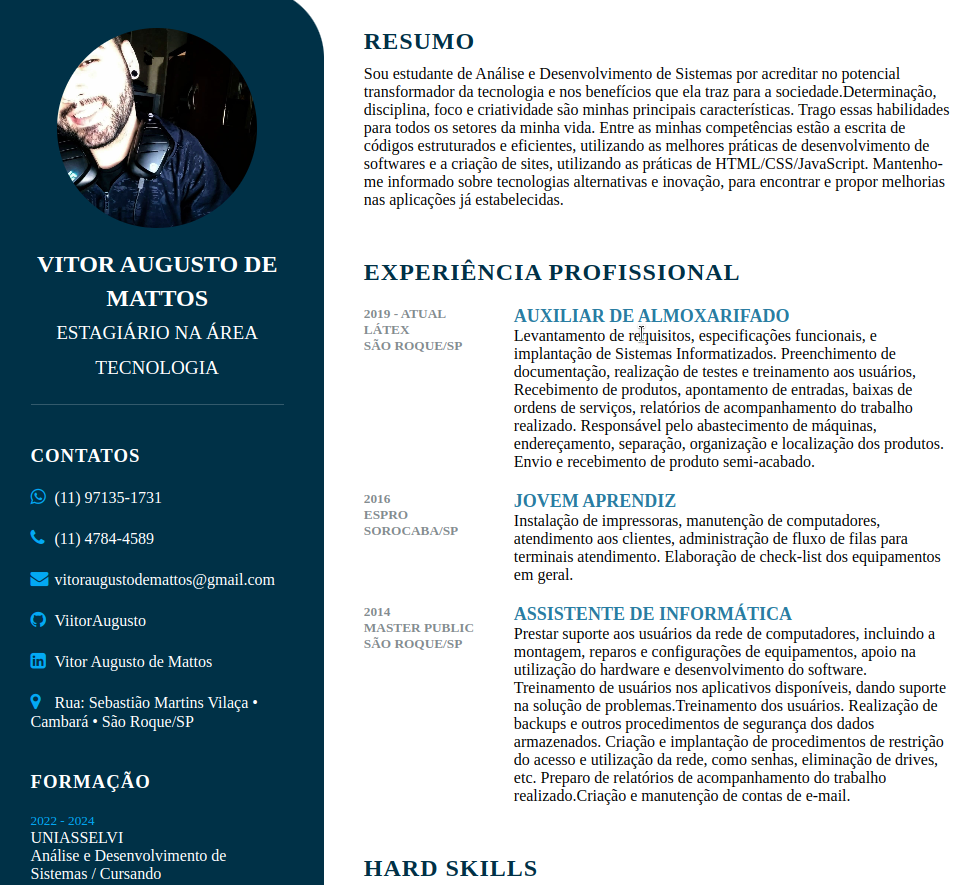

<h1 align="center"><a href="#"> 💻 Projeto Page</a></h1>

Minha primeira Page, meu primeiro projeto desenvolvido, como um objetivo de ser um currículo, mostra o quão eu evoluo vendo esse projeto.

  <a href="#-tecnologias">Tecnologias</a>&nbsp;&nbsp;&nbsp;|&nbsp;&nbsp;&nbsp;
  <a href="#-projeto">Projeto</a>&nbsp;&nbsp;&nbsp;|&nbsp;&nbsp;&nbsp;
  <a href="#memo-licença">Licença</a>

  

 

  

## 🚀 Tecnologias

Esse projeto foi desenvolvido com as seguintes tecnologias:

- HTML e CSS

Feito por Vitor Augusto [Meu Linkedlin](https://www.linkedin.com/in/viitoraugusto/)
